## ls <!-- {docsify-ignore-all} -->

   

### 处理过程

```plantuml
@startuml
hide empty description
<style>
root {
  HyperlinkColor #42b983
}
</style>

hide empty description
state "开始" as Begin <<start>> [[$./ls#begin {"开始"}]]
state "准备参数" as PREPAREPARAM_01  [[$./ls#prepareparam_01 {"准备参数"}]]
state "实体数据查询" as DEDATAQUERY_01  [[$./ls#dedataquery_01 {"实体数据查询"}]]
state "结束" as END_01 <<end>> [[$./ls#end_01 {"结束"}]]


Begin --> PREPAREPARAM_01
PREPAREPARAM_01 --> DEDATAQUERY_01
DEDATAQUERY_01 --> END_01


@enduml
```

### 处理步骤说明

#### 开始 :id=Begin [开始]

*- N/A*
#### 准备参数 :id=PREPAREPARAM_01 [准备参数]

1. 将`Default(传入变量).ID(知识库标识)` 设置给  `docfilter.kbid`
2. 将`150` 设置给  `docfilter.size(内容大小)`
3. 将`sequence,asc` 设置给  `docfilter.sort`
4. 将`计算式 null` 设置给  `docfilter.n_kb_id_eq`

#### 实体数据查询 :id=DEDATAQUERY_01 [实体数据查询]

调用实体 [知识库文档(AI_KB_DOCUMENT)](module/ai/ai_kb_document.md) 数据查询 [数据查询(ls)](module/ai/ai_kb_document#数据查询) ，查询参数为`docfilter`

将执行结果返回给参数`doclist`

#### 结束 :id=END_01 [结束]

返回 `doclist`

### 实体逻辑参数

|    中文名   |    代码名    |  数据类型    |  实体   |备注 |
| --------| --------| -------- | -------- | --------   |
|传入变量(<i class="fa fa-check"/></i>)|Default|数据对象|[知识库(AI_KNOWLEDGE_BASE)](module/ai/ai_knowledge_base.md)||
|docfilter|docfilter|过滤器|||
|doclist|doclist|数据对象列表|[知识库文档(AI_KB_DOCUMENT)](module/ai/ai_kb_document.md)||
