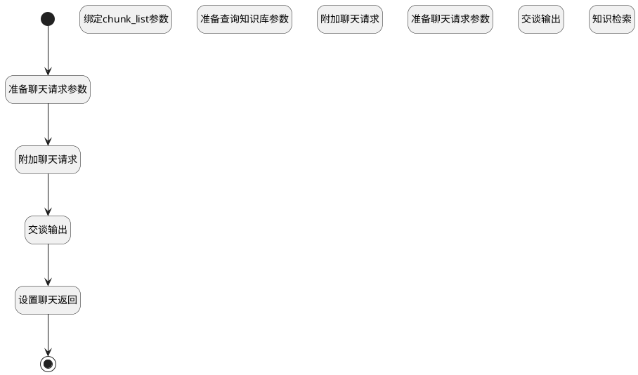

## 获取参考资料 <!-- {docsify-ignore-all} -->

   

### 处理过程

### 处理步骤说明

#### 准备查询知识库参数 :id=PREPAREPARAM_02 [准备参数]

1. 将`Default(传入变量).id(知识库标识)` 设置给  `chunk_query.n_kbid_eq`
2. 将`Default(传入变量).query` 设置给  `chunk_query.query`
3. 将`0.7` 设置给  `chunk_query.n_vector_similarity_gtandeq`
4. 将`2` 设置给  `chunk_query.n_rerank_eq`
5. 将`10` 设置给  `chunk_query.size`
6. 将`0.2` 设置给  `chunk_query.n_similarity_gtandeq`
7. 将`片段A` 设置给  `chunk_query.chunksnprefix`
8. 将`chunkview://{id}` 设置给  `chunk_query.chunkviewurl`
9. 将`2` 设置给  `chunk_query.n_pageindex_eq`

#### 开始 :id=Begin [开始]

*- N/A*
#### 知识检索 :id=SYSAICHATAGENT_FETCHCHUNKS_01 [SYSAICHATAGENT_FETCHCHUNKS]

#### 准备聊天请求参数 :id=PREPAREPARAM_04 [准备参数]

1. 将`Default(传入变量).id(知识库标识)` 设置给  `chat_request.knowledgebases`
2. 将`Default(传入变量).query` 设置给  `chat_request.chunkqueries`

#### 绑定chunk_list参数 :id=BINDPARAM_01 [绑定参数]

绑定参数`chunk_page` 到 `chunk_list`
#### 附加聊天请求 :id=SYSAICHATAGENT_APPENDCHATREQUEST_02 [SYSAICHATAGENT_APPENDCHATREQUEST]

#### 附加聊天请求 :id=SYSAICHATAGENT_APPENDCHATREQUEST_01 [SYSAICHATAGENT_APPENDCHATREQUEST]

#### 交谈输出 :id=SYSAICHATAGENT_CHATOUTPUT_02 [SYSAICHATAGENT_CHATOUTPUT]

#### 准备聊天请求参数 :id=PREPAREPARAM_03 [准备参数]

1. 将`no` 设置给  `chat_request.chunksection`
2. 将`no` 设置给  `chat_request.chunkprompt`
3. 将`chunk_list` 设置给  `chat_request.chunks`

#### 交谈输出 :id=SYSAICHATAGENT_CHATOUTPUT_01 [SYSAICHATAGENT_CHATOUTPUT]

#### 设置聊天返回 :id=PREPAREPARAM_01 [准备参数]

1. 将`chat_response.content` 设置给  `Default(传入变量).result`

#### 结束 :id=END_01 [结束]

返回 `Default(传入变量)`

### 实体逻辑参数

|    中文名   |    代码名    |  数据类型    |  实体   |备注 |
| --------| --------| -------- | -------- | --------   |
|传入变量(<i class="fa fa-check"/></i>)|Default|数据对象|[知识库(AI_KNOWLEDGE_BASE)](module/ai/ai_knowledge_base.md)||
|chat_request|chat_request||||
|chat_response|chat_response||||
|chunk_list|chunk_list|数据对象列表|[知识库文档分块(AI_KB_CHUNK)](module/ai/ai_kb_chunk.md)||
|chunk_page|chunk_page|分页查询|||
|chunk_query|chunk_query|过滤器|||
