## 推理 <!-- {docsify-ignore-all} -->

   

### 处理过程

```plantuml
@startuml
hide empty description
<style>
root {
  HyperlinkColor #42b983
}
</style>

hide empty description
state "开始" as Begin <<start>> [[$./reason#begin {"开始"}]]
state "拷贝default" as COPYPARAM_01  [[$./reason#copyparam_01 {"拷贝default"}]]
state "获取知识库信息" as DEACTION_01  [[$./reason#deaction_01 {"获取知识库信息"}]]
state "准备参数" as PREPAREPARAM_01  [[$./reason#prepareparam_01 {"准备参数"}]]
state "准备参数" as PREPAREPARAM_02  [[$./reason#prepareparam_02 {"准备参数"}]]
state "实体数据查询" as DEDATAQUERY_01  [[$./reason#dedataquery_01 {"实体数据查询"}]]
state "获取agent_context" as DELOGIC_01  [[$./reason#delogic_01 {"获取agent_context"}]]
state "准备引用参数" as PREPAREPARAM_06  [[$./reason#prepareparam_06 {"准备引用参数"}]]
state "设置chunkqueries" as RAWSFCODE_01  [[$./reason#rawsfcode_01 {"设置chunkqueries"}]]
state "附加聊天请求" as SYSAICHATAGENT_APPENDCHATREQUEST_02  [[$./reason#sysaichatagent_appendchatrequest_02 {"附加聊天请求"}]]
state "异常信息" as COPYPARAM_02  [[$./reason#copyparam_02 {"异常信息"}]]
state "准备参数" as PREPAREPARAM_03  [[$./reason#prepareparam_03 {"准备参数"}]]
state "创建report" as DEACTION_02  [[$./reason#deaction_02 {"创建report"}]]
state "结束" as END_01 <<end>> [[$./reason#end_01 {"结束"}]]
state "准备参数" as PREPAREPARAM_07  [[$./reason#prepareparam_07 {"准备参数"}]]
state "交谈输出" as SYSAICHATAGENT_CHATOUTPUT_02  [[$./reason#sysaichatagent_chatoutput_02 {"交谈输出"}]]
state "提取参考材料" as PREPAREPARAM_08  [[$./reason#prepareparam_08 {"提取参考材料"}]]
state "附加聊天请求" as SYSAICHATAGENT_APPENDCHATREQUEST_01  [[$./reason#sysaichatagent_appendchatrequest_01 {"附加聊天请求"}]]
state "交谈输出" as SYSAICHATAGENT_CHATOUTPUT_01  [[$./reason#sysaichatagent_chatoutput_01 {"交谈输出"}]]
state "准备参数" as PREPAREPARAM_04  [[$./reason#prepareparam_04 {"准备参数"}]]
state "保存报告" as DEACTION_03  [[$./reason#deaction_03 {"保存报告"}]]
state "执行脚本代码" as RAWSFCODE_02  [[$./reason#rawsfcode_02 {"执行脚本代码"}]]
state "结束" as END_02 <<end>> [[$./reason#end_02 {"结束"}]]


Begin --> COPYPARAM_01
COPYPARAM_01 --> DEACTION_01
DEACTION_01 --> PREPAREPARAM_01
PREPAREPARAM_01 --> DELOGIC_01
DELOGIC_01 -[#red]-> COPYPARAM_02
COPYPARAM_02 --> PREPAREPARAM_02
PREPAREPARAM_02 --> DEDATAQUERY_01
DEDATAQUERY_01 --> PREPAREPARAM_03 : [[$./reason#dedataquery_01-prepareparam_03{不存在report} 不存在report]]
PREPAREPARAM_03 --> DEACTION_02
DEACTION_02 --> END_01
DELOGIC_01 --> PREPAREPARAM_07 : [[$./reason#delogic_01-prepareparam_07{无知识库} 无知识库]]
PREPAREPARAM_07 --> SYSAICHATAGENT_APPENDCHATREQUEST_01
SYSAICHATAGENT_APPENDCHATREQUEST_01 --> SYSAICHATAGENT_CHATOUTPUT_01
SYSAICHATAGENT_CHATOUTPUT_01 -[#red]-> COPYPARAM_02
SYSAICHATAGENT_CHATOUTPUT_01 --> PREPAREPARAM_04
PREPAREPARAM_04 --> RAWSFCODE_02
RAWSFCODE_02 --> DEACTION_03
DEACTION_03 --> END_02
DELOGIC_01 --> PREPAREPARAM_06 : [[$./reason#delogic_01-prepareparam_06{有知识库} 有知识库]]
PREPAREPARAM_06 --> RAWSFCODE_01
RAWSFCODE_01 --> SYSAICHATAGENT_APPENDCHATREQUEST_02
SYSAICHATAGENT_APPENDCHATREQUEST_02 --> SYSAICHATAGENT_CHATOUTPUT_02
SYSAICHATAGENT_CHATOUTPUT_02 --> PREPAREPARAM_08
PREPAREPARAM_08 --> PREPAREPARAM_07
SYSAICHATAGENT_CHATOUTPUT_02 -[#red]-> COPYPARAM_02


@enduml
```




### 处理步骤说明

#### 开始 :id=Begin<sup class="footnote-symbol"> <font color=gray size=1>[开始]</font></sup>


*- N/A*
#### 拷贝default :id=COPYPARAM_01<sup class="footnote-symbol"> <font color=gray size=1>[拷贝参数]</font></sup>


拷贝参数`Default(传入变量)` 到 `default_temp`

#### 获取知识库信息 :id=DEACTION_01<sup class="footnote-symbol"> <font color=gray size=1>[实体行为]</font></sup>


调用实体 [知识库(AI_KNOWLEDGE_BASE)](module/ai/ai_knowledge_base.md) 行为 [Get](module/ai/ai_knowledge_base#行为) ，行为参数为`Default(传入变量)`

将执行结果返回给参数`Default(传入变量)`

#### 准备参数 :id=PREPAREPARAM_01<sup class="footnote-symbol"> <font color=gray size=1>[准备参数]</font></sup>


1. 将`default_temp.agenttag` 设置给  `chat_request.srfaiagenttag`
2. 将`default_temp.ID(知识库标识)` 设置给  `chat_request.knowledgebases`
3. 将`default_temp.agenttag` 绑定给  `agenttag`
4. 将`default_temp.agenttag` 设置给  `agent.CODE_NAME(代码标识)`

#### 准备参数 :id=PREPAREPARAM_02<sup class="footnote-symbol"> <font color=gray size=1>[准备参数]</font></sup>


1. 将`Default(传入变量).ID(知识库标识)` 设置给  `query_report.KB_ID(知识库标识)`
2. 将`agenttag` 设置给  `query_report.AGENT_TAG(智能体标记)`

#### 实体数据查询 :id=DEDATAQUERY_01<sup class="footnote-symbol"> <font color=gray size=1>[实体数据查询]</font></sup>


调用实体 [智能审查报告(AI_REVIEW_REPORT)](module/ai/ai_review_report.md) 数据查询 [Bykb_id_agent](module/ai/ai_review_report#数据查询) ，查询参数为`query_report`

将执行结果返回给参数`exists_report`

#### 附加聊天请求 :id=SYSAICHATAGENT_APPENDCHATREQUEST_02<sup class="footnote-symbol"> <font color=gray size=1>[SYSAICHATAGENT_APPENDCHATREQUEST]</font></sup>


#### 设置chunkqueries :id=RAWSFCODE_01<sup class="footnote-symbol"> <font color=gray size=1>[直接后台代码]</font></sup>


<p class="panel-title"><b>执行代码[Groovy]</b></p>

```groovy
/*Groovy*/
def _refrence_chat_request = logic.param('refrence_chat_request').getReal()
def _kb = logic.param('default').getReal()
def _agententity = logic.param('agent').getReal()

String chunkqueries = "我需要执行如下任务，请帮我查询相关信息，精简输出为引用参考资料。"
if(_agententity.get('context_content')){
  chunkqueries += "\n" + _agententity.get('context_content')
}

chunkqueries += "\n任务目标数据情况如下："

if(_kb.get('guidance_prompt')){
  chunkqueries += _kb.get('guidance_prompt')
}else if(_kb.get('description')){
  chunkqueries += _kb.get('description')
}

_refrence_chat_request.set('chunkqueries',chunkqueries)
```

#### 准备引用参数 :id=PREPAREPARAM_06<sup class="footnote-symbol"> <font color=gray size=1>[准备参数]</font></sup>


1. 将`agent.SPEC_KB_ID(规格库标识)` 设置给  `refrence_chat_request.knowledgebases`
2. 将`1` 设置给  `refrence_chat_request.chunkpageindex`

#### 获取agent_context :id=DELOGIC_01<sup class="footnote-symbol"> <font color=gray size=1>[实体逻辑]</font></sup>


调用实体 [智能体业务上下文(AI_AGENT_CONTEXT)](module/ai/ai_agent_context.md) 处理逻辑 [get_by_code]((module/ai/ai_agent_context/logic/get_by_code.md)) ，行为参数为`agent(agent)`
将执行结果返回给参数`agent(agent)`

#### 异常信息 :id=COPYPARAM_02<sup class="footnote-symbol"> <font color=gray size=1>[拷贝参数]</font></sup>


拷贝参数`last` 到 `exception_entity`

#### 准备参数 :id=PREPAREPARAM_03<sup class="footnote-symbol"> <font color=gray size=1>[准备参数]</font></sup>


1. 将`Default(传入变量).ID(知识库标识)` 设置给  `report.KB_ID(知识库标识)`
2. 将`agenttag` 设置给  `report.AGENT_TAG(智能体标记)`
3. 将`error` 设置给  `report.REVIEW_RESULT(审查结果)`
4. 将`exception_entity.info` 设置给  `report.REVIEW_REPORT(报告)`
5. 将`Default(传入变量).NAME(知识库名称)` 设置给  `report.NAME(审查对象)`

#### 创建report :id=DEACTION_02<sup class="footnote-symbol"> <font color=gray size=1>[实体行为]</font></sup>


调用实体 [智能审查报告(AI_REVIEW_REPORT)](module/ai/ai_review_report.md) 行为 [upsert](module/ai/ai_review_report#行为) ，行为参数为`report`

#### 结束 :id=END_01<sup class="footnote-symbol"> <font color=gray size=1>[结束]</font></sup>


返回 `Default(传入变量)`

#### 准备参数 :id=PREPAREPARAM_07<sup class="footnote-symbol"> <font color=gray size=1>[准备参数]</font></sup>


1. 将`agent.PAGE_INDEX(启用增强目录召回)` 设置给  `chat_request.chunkpageindex`
2. 将`agent.context_content` 设置给  `default_temp.context_content`

#### 交谈输出 :id=SYSAICHATAGENT_CHATOUTPUT_02<sup class="footnote-symbol"> <font color=gray size=1>[SYSAICHATAGENT_CHATOUTPUT]</font></sup>


#### 提取参考材料 :id=PREPAREPARAM_08<sup class="footnote-symbol"> <font color=gray size=1>[准备参数]</font></sup>


1. 将`refrence_chat_response.context` 绑定给  `refrence`

#### 附加聊天请求 :id=SYSAICHATAGENT_APPENDCHATREQUEST_01<sup class="footnote-symbol"> <font color=gray size=1>[SYSAICHATAGENT_APPENDCHATREQUEST]</font></sup>


#### 交谈输出 :id=SYSAICHATAGENT_CHATOUTPUT_01<sup class="footnote-symbol"> <font color=gray size=1>[SYSAICHATAGENT_CHATOUTPUT]</font></sup>


#### 准备参数 :id=PREPAREPARAM_04<sup class="footnote-symbol"> <font color=gray size=1>[准备参数]</font></sup>


1. 将`Default(传入变量).ID(知识库标识)` 设置给  `report.KB_ID(知识库标识)`
2. 将`Default(传入变量).NAME(知识库名称)` 设置给  `report.NAME(审查对象)`
3. 将`agenttag` 设置给  `report.AGENT_TAG(智能体标记)`
4. 将`chat_response.content` 设置给  `report.REVIEW_REPORT(报告)`

#### 保存报告 :id=DEACTION_03<sup class="footnote-symbol"> <font color=gray size=1>[实体行为]</font></sup>


调用实体 [智能审查报告(AI_REVIEW_REPORT)](module/ai/ai_review_report.md) 行为 [upsert](module/ai/ai_review_report#行为) ，行为参数为`report`

将执行结果返回给参数`report`

#### 执行脚本代码 :id=RAWSFCODE_02<sup class="footnote-symbol"> <font color=gray size=1>[直接后台代码]</font></sup>


<p class="panel-title"><b>执行代码[Groovy]</b></p>

```groovy
def report = logic.param('report').getReal()
def review = report.get("review_report")
if (review) {
    try {
        def jsonContent = net.ibizsys.central.cloud.core.ai.util.AIChatUtils.getJsonContent(review)
        def json = new groovy.json.JsonSlurper().parseText(jsonContent)
        
        // 只处理Map类型
        if (json && json instanceof Map) {
            def result = json.get("result")
            def check = json.get("check_info")
            
            if (result != null) {
                report.set("review_result", result)
            }
            if (check != null) {
                report.set("check_info", check)
            }
        } 
    } catch (Exception e) {
        println("处理报告时发生错误: " + e.message)
    }
}
```

#### 结束 :id=END_02<sup class="footnote-symbol"> <font color=gray size=1>[结束]</font></sup>


返回 `Default(传入变量)`


### 连接条件说明
#### 不存在report :id=DEDATAQUERY_01-PREPAREPARAM_03

`exists_report(exists_report).size` EQ `0`
#### 无知识库 :id=DELOGIC_01-PREPAREPARAM_07

`agent(agent).SPEC_KB_ID(规格库标识)` ISNULL
#### 有知识库 :id=DELOGIC_01-PREPAREPARAM_06

`agent(agent).SPEC_KB_ID(规格库标识)` ISNOTNULL


### 实体逻辑参数

|    中文名   |    代码名    |  数据类型    |  实体   |备注 |
| --------| --------| -------- | -------- | --------   |
|传入变量(<i class="fa fa-check"/></i>)|Default|数据对象|[知识库(AI_KNOWLEDGE_BASE)](module/ai/ai_knowledge_base.md)||
|agent|agent|数据对象|[智能体业务上下文(AI_AGENT_CONTEXT)](module/ai/ai_agent_context.md)||
|agenttag|agenttag|简单数据|||
|chat_request|chat_request||||
|chat_response|chat_response||||
|chat_response_entity|chat_response_entity|数据对象|||
|default_temp|default_temp|数据对象|[知识库(AI_KNOWLEDGE_BASE)](module/ai/ai_knowledge_base.md)||
|exception_entity|exception_entity|数据对象|||
|文档列表|exists_doc|数据对象列表|[知识库文档(AI_KB_DOCUMENT)](module/ai/ai_kb_document.md)||
|exists_report|exists_report|数据对象列表|[智能审查报告(AI_REVIEW_REPORT)](module/ai/ai_review_report.md)||
|last|last|上一次调用返回|||
|文档过滤器|query_doc|过滤器|||
|query_report|query_report|过滤器|||
|refrence|refrence|简单数据|||
|refrence_chat_request|refrence_chat_request||||
|refrence_chat_response|refrence_chat_response||||
|report|report|数据对象|[智能审查报告(AI_REVIEW_REPORT)](module/ai/ai_review_report.md)||
