## 重置分片索引数据 <!-- {docsify-ignore-all} -->

   

### 处理过程

```plantuml
@startuml
hide empty description
<style>
root {
  HyperlinkColor #42b983
}
</style>

hide empty description
state "开始" as Begin <<start>> [[$./reset_all_chunk#begin {"开始"}]]
state "直接SQL调用" as RAWSQLCALL_01  [[$./reset_all_chunk#rawsqlcall_01 {"直接SQL调用"}]]


Begin --> RAWSQLCALL_01


@enduml
```




### 处理步骤说明

#### 开始 :id=Begin<sup class="footnote-symbol"> <font color=gray size=1>[开始]</font></sup>


*- N/A*
#### 直接SQL调用 :id=RAWSQLCALL_01<sup class="footnote-symbol"> <font color=gray size=1>[直接SQL调用]</font></sup>


<p class="panel-title"><b>执行sql语句</b></p>

```sql
delete from ai_kb_chunk where document_id in (select id from ai_kb_document where kb_id=?) ;
delete from ai_kb_graph_entity_chunk where ai_kb_graph_entity_chunk.entity_id in (select id from ai_kb_graph_entity where kb_id=?) ;
delete from ai_kb_graph_entity where  kb_id=? ;
delete from ai_kb_graph_relation_chunk where ai_kb_graph_relation_chunk.relation_id in (select id from ai_kb_graph_relation where kb_id=?) ;
delete from ai_kb_graph_relation where   kb_id=?  ;
update ai_kb_document set chunk_method=(select chunk_method from ai_knowledge_base where ai_knowledge_base.id=ai_kb_document.kb_id),status='3',parsed_content = null where kb_id = '785219b0c35d9739f271d5cba07df681';

```

<p class="panel-title"><b>执行sql参数</b></p>

1. `Default(传入变量).ID(知识库标识)`
2. `Default(传入变量).ID(知识库标识)`
3. `Default(传入变量).ID(知识库标识)`
4. `Default(传入变量).ID(知识库标识)`
5. `Default(传入变量).ID(知识库标识)`
6. `Default(传入变量).ID(知识库标识)`


### 实体逻辑参数

|    中文名   |    代码名    |  数据类型    |  实体   |备注 |
| --------| --------| -------- | -------- | --------   |
|传入变量(<i class="fa fa-check"/></i>)|Default|数据对象|[知识库(AI_KNOWLEDGE_BASE)](module/ai/ai_knowledge_base.md)||
