## 知识库切换（对话窗口） <!-- {docsify-ignore-all} -->

   

### 处理过程

```plantuml
@startuml
hide empty description
<style>
root {
  HyperlinkColor #42b983
}
</style>

hide empty description
state "开始" as Begin <<start>> [[$./switch_set#begin {"开始"}]]
state "当前选中知识库" as DEDATAQUERY_01  [[$./switch_set#dedataquery_01 {"当前选中知识库"}]]
state "只查询前100条" as PREPAREPARAM_01  [[$./switch_set#prepareparam_01 {"只查询前100条"}]]
state "Main数据集" as DEDATASET_01  [[$./switch_set#dedataset_01 {"Main数据集"}]]
state "准备参数" as PREPAREPARAM_02  [[$./switch_set#prepareparam_02 {"准备参数"}]]
state "执行脚本代码" as RAWSFCODE_01  [[$./switch_set#rawsfcode_01 {"执行脚本代码"}]]
state "结束" as END_01 <<end>> [[$./switch_set#end_01 {"结束"}]]


Begin --> DEDATAQUERY_01
DEDATAQUERY_01 --> PREPAREPARAM_01
PREPAREPARAM_01 --> DEDATASET_01
DEDATASET_01 --> PREPAREPARAM_02
PREPAREPARAM_02 --> RAWSFCODE_01
RAWSFCODE_01 --> END_01


@enduml
```




### 处理步骤说明

#### 开始 :id=Begin<sup class="footnote-symbol"> <font color=gray size=1>[开始]</font></sup>


*- N/A*
#### 当前选中知识库 :id=DEDATAQUERY_01<sup class="footnote-symbol"> <font color=gray size=1>[实体数据查询]</font></sup>


调用实体 [知识库(AI_KNOWLEDGE_BASE)](module/ai/ai_knowledge_base.md) 数据查询 [CurSelected](module/ai/ai_knowledge_base#数据查询) ，查询参数为`Default(传入变量)`

将执行结果返回给参数`curselectedlist(当前选中)`

#### 只查询前100条 :id=PREPAREPARAM_01<sup class="footnote-symbol"> <font color=gray size=1>[准备参数]</font></sup>


1. 将`100` 设置给  `mainfilter.size`
2. 将`Default(传入变量).knowledgebases` 设置给  `mainfilter.n_id_noteq`

#### Main数据集 :id=DEDATASET_01<sup class="footnote-symbol"> <font color=gray size=1>[实体数据集]</font></sup>


调用实体 [知识库(AI_KNOWLEDGE_BASE)](module/ai/ai_knowledge_base.md) 数据集合 [主表格查询(main)](module/ai/ai_knowledge_base#数据集合) ，查询参数为`mainfilter`

将执行结果返回给参数`mainpage`

#### 准备参数 :id=PREPAREPARAM_02<sup class="footnote-symbol"> <font color=gray size=1>[准备参数]</font></sup>


1. 将`mainpage` 绑定给  `mainlist`

#### 执行脚本代码 :id=RAWSFCODE_01<sup class="footnote-symbol"> <font color=gray size=1>[直接后台代码]</font></sup>


<p class="panel-title"><b>执行代码[Groovy]</b></p>

```groovy
def mainlist = logic.param("mainlist").getReal();
def curselectedlist = logic.param("curselectedlist").getReal()
curselectedlist.addAll(mainlist)
```

#### 结束 :id=END_01<sup class="footnote-symbol"> <font color=gray size=1>[结束]</font></sup>


返回 `curselectedlist(当前选中)`


### 实体逻辑参数

|    中文名   |    代码名    |  数据类型    |  实体   |备注 |
| --------| --------| -------- | -------- | --------   |
|传入变量(<i class="fa fa-check"/></i>)|Default|过滤器|||
|当前选中|curselectedlist|数据对象列表|[知识库(AI_KNOWLEDGE_BASE)](module/ai/ai_knowledge_base.md)||
|mainfilter|mainfilter|过滤器|||
|mainlist|mainlist|数据对象列表|[知识库(AI_KNOWLEDGE_BASE)](module/ai/ai_knowledge_base.md)||
|mainpage|mainpage|分页查询|||
