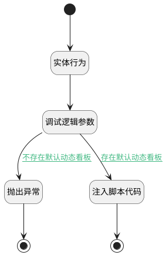

## 查找知识库首页模版 <!-- {docsify-ignore-all} -->

   

### 处理过程




### 处理步骤说明

#### 开始 :id=Begin<sup class="footnote-symbol"> <font color=gray size=1>[开始]</font></sup>


#### 抛出异常 :id=THROWEXCEPTION1<sup class="footnote-symbol"> <font color=gray size=1>[抛出异常]</font></sup>


> [!ATTENTION|label:抛出异常|icon:fa fa-warning]
> 错误信息：系统未配置知识库默认首页动态看板

#### 结束 :id=END1<sup class="footnote-symbol"> <font color=gray size=1>[结束]</font></sup>


#### 实体行为 :id=DEACTION1<sup class="footnote-symbol"> <font color=gray size=1>[实体行为]</font></sup>


调用实体 [知识库(AI_KNOWLEDGE_BASE)](module/ai/ai_knowledge_base.md) 行为 [查找知识库首页模版(find_template)](module/ai/ai_knowledge_base#行为) ，行为参数为`kb_entity`

将执行结果返回给参数`kb_entity`

#### 调试逻辑参数 :id=DEBUGPARAM1<sup class="footnote-symbol"> <font color=gray size=1>[调试逻辑参数]</font></sup>


> [!NOTE|label:调试信息|icon:fa fa-bug]
> 调试输出参数`kb_entity`的详细信息

#### 注入脚本代码 :id=RAWJSCODE2<sup class="footnote-symbol"> <font color=gray size=1>[直接前台代码]</font></sup>


<p class="panel-title"><b>执行代码</b></p>

```javascript
var _kb_entity = uiLogic.kb_entity;
console.log('正在设置知识库首页动态看板');
if(_kb_entity){
    const c = view.ctx.controllersMap.get('drbar');
    if(c){
        c.context.dyna_dashboard = _kb_entity.dyna_dashboard_id;
        c.context.srfdynadashboardid = _kb_entity.dyna_dashboard_id;
    }
}
```

#### 结束 :id=END2<sup class="footnote-symbol"> <font color=gray size=1>[结束]</font></sup>


### 连接条件说明
#### 不存在默认动态看板 :id=DEBUGPARAM1-THROWEXCEPTION1

```kb_entity(kb_entity).dyna_dashboard_id``` ISNULL
#### 存在默认动态看板 :id=DEBUGPARAM1-RAWJSCODE2

```kb_entity(kb_entity).dyna_dashboard_id``` ISNOTNULL


### 实体逻辑参数

|    中文名   |    代码名    |  数据类型      |备注 |
| --------| --------| --------  | --------   |
|上下文|ctx|导航视图参数绑定参数||
|传入变量(<i class="fa fa-check"/></i>)|Default|数据对象||
|kb_entity|kb_entity|数据对象||
