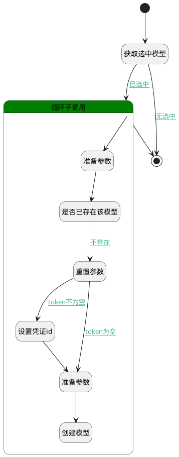

## 生成提供商模型 <!-- {docsify-ignore-all} -->

   

### 处理过程




### 处理步骤说明

#### 获取选中模型 :id=BINDPARAM_01<sup class="footnote-symbol"> <font color=gray size=1>[绑定参数]</font></sup>


绑定参数`Default(传入变量)` 到 `srfactionparam`
#### 开始 :id=Begin<sup class="footnote-symbol"> <font color=gray size=1>[开始]</font></sup>


*- N/A*
#### 循环子调用 :id=LOOPSUBCALL_01<sup class="footnote-symbol"> <font color=gray size=1>[循环子调用]</font></sup>


循环参数`srfactionparam`，子循环参数使用`temp_obj`
#### 结束 :id=END_01<sup class="footnote-symbol"> <font color=gray size=1>[结束]</font></sup>


*- N/A*

#### 准备参数 :id=PREPAREPARAM_01<sup class="footnote-symbol"> <font color=gray size=1>[准备参数]</font></sup>


1. 将`temp_obj.ID` 设置给  `model_filter.N_CODE_NAME_EQ`
2. 将`Default(传入变量).ai_model_provider` 设置给  `model_filter.N_PROVIDER_EQ`

#### 是否已存在该模型 :id=DEDATASET_01<sup class="footnote-symbol"> <font color=gray size=1>[实体数据集]</font></sup>


调用实体 [AI大模型(AI_MODEL)](module/ai/ai_model.md) 数据集合 [DEFAULT](module/ai/ai_model#数据集合) ，查询参数为`model_filter`

将执行结果返回给参数`ai_models`

#### 重置参数 :id=RESETPARAM_01<sup class="footnote-symbol"> <font color=gray size=1>[重置参数]</font></sup>


重置参数```create_obj(create_obj)```
#### 设置凭证id :id=PREPAREPARAM_03<sup class="footnote-symbol"> <font color=gray size=1>[准备参数]</font></sup>


1. 将`Default(传入变量).ai_model_provider` 设置给  `create_obj.AI_CREDENTIAL_ID(AI凭证标识)`

#### 准备参数 :id=PREPAREPARAM_02<sup class="footnote-symbol"> <font color=gray size=1>[准备参数]</font></sup>


1. 将`Default(传入变量).base_url` 设置给  `create_obj.base_url`
2. 将`temp_obj.id` 设置给  `create_obj.CODE_NAME(模型标识)`
3. 将`temp_obj.id` 设置给  `create_obj.NAME(模型名称)`
4. 将`Default(传入变量).ai_model_provider` 设置给  `create_obj.PROVIDER(模型提供商标识)`
5. 将`Default(传入变量).default_version` 设置给  `create_obj.default_version`
6. 将`计算式 null` 设置给  `create_obj.API_BASE_URL(模型 API 地址)`

#### 创建模型 :id=DEACTION_01<sup class="footnote-symbol"> <font color=gray size=1>[实体行为]</font></sup>


调用实体 [AI大模型(AI_MODEL)](module/ai/ai_model.md) 行为 [Create](module/ai/ai_model#行为) ，行为参数为`create_obj`


### 连接条件说明
#### 已选中 :id=BINDPARAM_01-LOOPSUBCALL_01

`srfactionparam(srfactionparam).length` GT `0`
#### 不存在 :id=DEDATASET_01-RESETPARAM_01

`ai_models(ai_models).size` EQ `0`
#### token不为空 :id=RESETPARAM_01-PREPAREPARAM_03

`Default(传入变量).default_token` ISNOTNULL
#### token为空 :id=RESETPARAM_01-PREPAREPARAM_02

`Default(传入变量).default_token` ISNULL
#### 无选中 :id=BINDPARAM_01-END_01

`srfactionparam(srfactionparam).length` EQ `0`


### 实体逻辑参数

|    中文名   |    代码名    |  数据类型    |  实体   |备注 |
| --------| --------| -------- | -------- | --------   |
|传入变量(<i class="fa fa-check"/></i>)|Default|数据对象|[AI大模型(AI_MODEL)](module/ai/ai_model.md)||
|ai_models|ai_models|分页查询|||
|create_obj|create_obj|数据对象|[AI大模型(AI_MODEL)](module/ai/ai_model.md)||
|model_filter|model_filter|过滤器|||
|srfactionparam|srfactionparam|数据对象列表|||
|temp_obj|temp_obj|数据对象|||
