## 获取模型提供商版本 <!-- {docsify-ignore-all} -->

   

### 处理过程

```plantuml
@startuml
hide empty description
<style>
root {
  HyperlinkColor #42b983
}
</style>

hide empty description
state "开始" as Begin <<start>> [[$./provider_model_version#begin {"开始"}]]
state "绑定提供商模型参数" as BINDPARAM_01  [[$./provider_model_version#bindparam_01 {"绑定提供商模型参数"}]]
state "结束" as END_01 <<end>> [[$./provider_model_version#end_01 {"结束"}]]
state "调用接口返回模型版本" as RAWSFCODE_01  [[$./provider_model_version#rawsfcode_01 {"调用接口返回模型版本"}]]


Begin --> RAWSFCODE_01
RAWSFCODE_01 --> BINDPARAM_01 : [[$./provider_model_version#rawsfcode_01-bindparam_01{连接名称} 连接名称]]
BINDPARAM_01 --> END_01


@enduml
```




### 处理步骤说明

#### 调用接口返回模型版本 :id=RAWSFCODE_01<sup class="footnote-symbol"> <font color=gray size=1>[直接后台代码]</font></sup>


<p class="panel-title"><b>执行代码[Groovy]</b></p>

```groovy
def page_temp = logic.param('page_temp').getReal()
def _default = logic.param('default').getReal()

def VERSION_PATTERN = ~/\/v\d+$/

        List<String> ENDPOINT_SUFFIXES = [
                "/chat/completions",
                "/embeddings",
                "/v1/embeddings",      // 某些厂商带 v1 的全路径
                "/v1/chat/completions",
                "/rerank",
                "/v1/rerank",
                "/services/rerank/text-rerank/text-rerank",
                "/v1/models",              // 查询模型清单的接口
                "/models"
        ]


        def getBaseUrl = { String userInput, String defaultVer = "/v1" ->
            if (!userInput?.trim()) return ""

            String url = userInput.trim().replaceAll(/\/+$/, "")


            for (suffix in ENDPOINT_SUFFIXES) {
                if (url.endsWith(suffix)) {
                    url = url.substring(0, url.length() - suffix.length()).replaceAll(/\/+$/, "")
                    break // 匹配到一个就跳出，防止重复切除
                }
            }

            if (!(url =~ VERSION_PATTERN) && !url.endsWith("/api")) {
                String path = defaultVer.startsWith("/") ? defaultVer : "/${defaultVer}"
                url += path
            }

            return url
        }
def base_url=_default.get("base_url")
def default_version=_default.get("default_version")
if(!default_version) {
    default_version="/v1"
}
def default_token=_default.get("default_token")
if(!default_token) {
    default_token=_default.get("access_token")
}

def api_base_url = _default.get("api_base_url")
if(!api_base_url) {
    api_base_url = base_url+default_version
}
def _uri = getBaseUrl(api_base_url,default_version)+"/models"


page_temp.set("provider_models",null)

try {
    def _webclient = sys.webclient()
    def _param =  [:]
    def _headers = [
        "Authorization": "Bearer "+default_token,
        "Content-Type": "application/json"
    ]

    def rep = _webclient.get(_uri,_param,_headers)
    List contentList = new ArrayList<>();
    def jsonMap = net.ibizsys.central.service.client.WebClientBase.MAPPER.readValue(rep.getBody(), Map.class)
    def dataList = jsonMap.get("data")

    if(!org.springframework.util.ObjectUtils.isEmpty(dataList)) {
        for(Object objItem: dataList) {
            net.ibizsys.central.util.EntityDTO dto = net.ibizsys.central.service.client.WebClientBase.MAPPER.convertValue(objItem, net.ibizsys.central.util.EntityDTO.class);
            def modelId = dto.get("id"); 
            if(modelId) {
                dto.set("name", modelId);
            }

            contentList.add(dto);
        }

        def  nPage = _default.page
        def nSize = _default.size
        def _models= new net.ibizsys.central.util.PageImpl(contentList, org.springframework.data.domain.PageRequest.of(nPage, nSize), contentList.size())
        page_temp.set("provider_models",_models)
    }   
}catch(Exception e){
     println("获取模型提供商版本错误: " + e.message)
}

```

#### 开始 :id=Begin<sup class="footnote-symbol"> <font color=gray size=1>[开始]</font></sup>


*- N/A*
#### 绑定提供商模型参数 :id=BINDPARAM_01<sup class="footnote-symbol"> <font color=gray size=1>[绑定参数]</font></sup>


绑定参数`page_temp` 到 `provider_models`
#### 结束 :id=END_01<sup class="footnote-symbol"> <font color=gray size=1>[结束]</font></sup>


返回 `provider_models`


### 连接条件说明
#### 连接名称 :id=RAWSFCODE_01-BINDPARAM_01

`page_temp(page_temp).provider_models` ISNOTNULL


### 实体逻辑参数

|    中文名   |    代码名    |  数据类型    |  实体   |备注 |
| --------| --------| -------- | -------- | --------   |
|传入变量(<i class="fa fa-check"/></i>)|Default|过滤器|||
|page_temp|page_temp|数据对象|||
|provider_models|provider_models|分页查询|||
