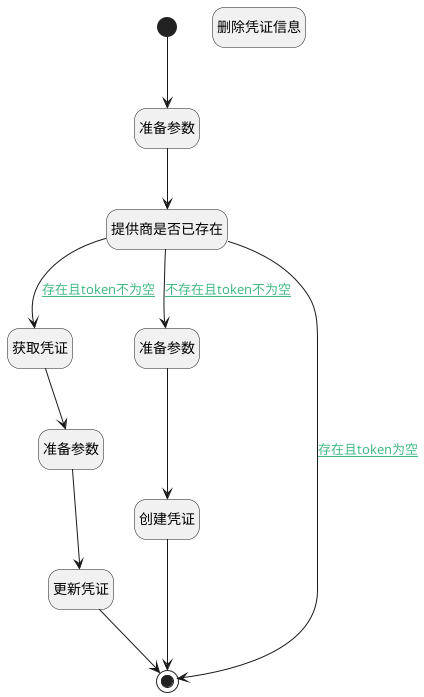

## 生成AI凭证 <!-- {docsify-ignore-all} -->

   

### 处理过程

### 处理步骤说明

#### 提供商是否已存在 :id=DEDATASET_01 [实体数据集]

调用实体 [AI凭证(AI_CREDENTIAL)](module/ai/ai_credential.md) 数据集合 [DEFAULT](module/ai/ai_credential#数据集合) ，查询参数为`credential_filter`

将执行结果返回给参数`credentials`

#### 准备参数 :id=PREPAREPARAM_01 [准备参数]

1. 将`Default(传入变量).ID(标识)` 设置给  `credential_filter.N_ID_EQ`
2. 将`Default(传入变量).ID(标识)` 设置给  `credential.ID(标识)`

#### 开始 :id=Begin [开始]

*- N/A*
#### 获取凭证 :id=DEACTION_03 [实体行为]

调用实体 [AI凭证(AI_CREDENTIAL)](module/ai/ai_credential.md) 行为 [Get](module/ai/ai_credential#行为) ，行为参数为`credential`

将执行结果返回给参数`credential`

#### 准备参数 :id=PREPAREPARAM_02 [准备参数]

1. 将`Default(传入变量).NAME(名称)` 设置给  `credential.NAME(名称)`
2. 将`Default(传入变量).DEFAULT_TOKEN(API 密钥)` 设置给  `credential.BEARER_TOKEN(Bearer令牌)`
3. 将`bearer_token` 设置给  `credential.CREDENTIAL_TYPE(凭证类型)`
4. 将`Default(传入变量).ID(标识)` 设置给  `credential.PROVIDER(模型提供商)`
5. 将`Default(传入变量).ID(标识)` 设置给  `credential.CODE_NAME(代码标识)`

#### 准备参数 :id=PREPAREPARAM_03 [准备参数]

1. 将`Default(传入变量).DEFAULT_TOKEN(API 密钥)` 设置给  `credential.BEARER_TOKEN(Bearer令牌)`

#### 删除凭证信息 :id=DEACTION_04 [实体行为]

不填写token时，删除凭证信息

调用实体 [AI凭证(AI_CREDENTIAL)](module/ai/ai_credential.md) 行为 [Remove](module/ai/ai_credential#行为) ，行为参数为`credential`

#### 创建凭证 :id=DEACTION_01 [实体行为]

调用实体 [AI凭证(AI_CREDENTIAL)](module/ai/ai_credential.md) 行为 [Create](module/ai/ai_credential#行为) ，行为参数为`credential`

#### 更新凭证 :id=DEACTION_02 [实体行为]

调用实体 [AI凭证(AI_CREDENTIAL)](module/ai/ai_credential.md) 行为 [Update](module/ai/ai_credential#行为) ，行为参数为`credential`

#### 结束 :id=END_01 [结束]

*- N/A*

### 连接条件说明
#### 不存在且token不为空 :id=DEDATASET_01-PREPAREPARAM_02

`credentials(credentials).size` EQ `0` AND `Default(传入变量).DEFAULT_TOKEN(API 密钥)` ISNOTNULL
#### 存在且token不为空 :id=DEDATASET_01-DEACTION_03

`credentials(credentials).size` GT `0` AND `Default(传入变量).DEFAULT_TOKEN(API 密钥)` ISNOTNULL
#### 存在且token为空 :id=DEDATASET_01-END_01

`credentials(credentials).size` GT `0` AND `Default(传入变量).DEFAULT_TOKEN(API 密钥)` ISNULL

### 实体逻辑参数

|    中文名   |    代码名    |  数据类型    |  实体   |备注 |
| --------| --------| -------- | -------- | --------   |
|传入变量(<i class="fa fa-check"/></i>)|Default|数据对象|[模型提供商(AI_MODEL_PROVIDER)](module/ai/ai_model_provider.md)||
|credential|credential|数据对象|[AI凭证(AI_CREDENTIAL)](module/ai/ai_credential.md)||
|credential_filter|credential_filter|过滤器|||
|credentials|credentials|分页查询|||
