## 获取转换html <!-- {docsify-ignore-all} -->

   

### 处理过程

```plantuml
@startuml
hide empty description
<style>
root {
  HyperlinkColor #42b983
}
</style>

hide empty description
state "开始" as Begin <<start>> [[$./ConvertedHTML#begin {"开始"}]]
state "执行脚本代码" as RAWSFCODE_01  [[$./ConvertedHTML#rawsfcode_01 {"执行脚本代码"}]]


Begin --> RAWSFCODE_01


@enduml
```




### 处理步骤说明

#### 开始 :id=Begin<sup class="footnote-symbol"> <font color=gray size=1>[开始]</font></sup>


*- N/A*
#### 执行脚本代码 :id=RAWSFCODE_01<sup class="footnote-symbol"> <font color=gray size=1>[直接后台代码]</font></sup>


<p class="panel-title"><b>执行代码[Groovy]</b></p>

```groovy
def _default = logic.param('Default').getReal(); 
def _review_report = _default.get("review_report")

com.vladsch.flexmark.parser.Parser parser = com.vladsch.flexmark.parser.Parser.builder().build();
com.vladsch.flexmark.util.ast.Node document = parser.parse(_review_report);
com.vladsch.flexmark.html.HtmlRenderer renderer = com.vladsch.flexmark.html.HtmlRenderer.builder().build();
def htmlContent = renderer.render(document);

_default.set("review_report_html",htmlContent);
```


### 实体逻辑参数

|    中文名   |    代码名    |  数据类型    |  实体   |备注 |
| --------| --------| -------- | -------- | --------   |
|传入变量(<i class="fa fa-check"/></i>)|Default|数据对象|[智能审查报告(AI_REVIEW_REPORT)](module/ai/ai_review_report.md)||
