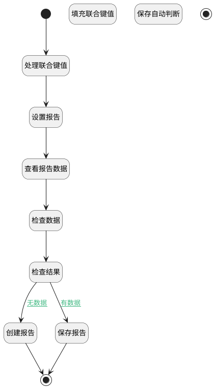

## upsert <!-- {docsify-ignore-all} -->

   

### 处理过程




### 处理步骤说明

#### 开始 :id=Begin<sup class="footnote-symbol"> <font color=gray size=1>[开始]</font></sup>


*- N/A*
#### 处理联合键值 :id=RAWSFCODE_02<sup class="footnote-symbol"> <font color=gray size=1>[直接后台代码]</font></sup>


<p class="panel-title"><b>执行代码[Groovy]</b></p>

```groovy
def defaultEntity = logic.param("default").getReal();
if(!defaultEntity.get("id"))
{
    String unionId=""
if (defaultEntity.get("kb_id"))
    unionId+=defaultEntity.getString("kb_id","")
if (defaultEntity.get("document_id"))
    unionId+=("||"+defaultEntity.getString("document_id",""))
if (defaultEntity.get("record_id"))
    unionId+=("||"+defaultEntity.getString("record_id",""))
if(!unionId)
    org.springframework.util.Assert.hasLength(unionId,"未传入审查对象");
if (defaultEntity.get("agent_tag"))
    unionId+=("||"+defaultEntity.getString("agent_tag",""))
    defaultEntity.set("id",net.ibizsys.runtime.util.KeyValueUtils.genUniqueId(unionId))
}
```

#### 设置报告 :id=PREPAREPARAM_01<sup class="footnote-symbol"> <font color=gray size=1>[准备参数]</font></sup>


    无

#### 查看报告数据 :id=DEBUGPARAM_01<sup class="footnote-symbol"> <font color=gray size=1>[调试逻辑参数]</font></sup>


> [!NOTE|label:调试信息|icon:fa fa-bug]
> 调试输出参数`Default(传入变量)`的详细信息


#### 填充联合键值 :id=RAWSFCODE_01<sup class="footnote-symbol"> <font color=gray size=1>[直接后台代码]</font></sup>


<p class="panel-title"><b>执行代码[Groovy]</b></p>

```groovy
def defaultEntity = logic.param("default").getReal();

String unionId=""
if (defaultEntity.get("kb_id"))
    unionId+=defaultEntity.getString("kb_id","")
if (defaultEntity.get("document_id"))
    unionId+=("||"+defaultEntity.getString("document_id",""))
if (defaultEntity.get("record_id"))
    unionId+=("||"+defaultEntity.getString("record_id",""))
if(!unionId)
    org.springframework.util.Assert.hasLength(unionId,"未传入审查对象");
if (defaultEntity.get("agent_tag"))
    unionId+=("||"+defaultEntity.getString("agent_tag",""))
defaultEntity.set("id",net.ibizsys.runtime.util.KeyValueUtils.genUniqueId(unionId))

```

#### 检查数据 :id=DEACTION_02<sup class="footnote-symbol"> <font color=gray size=1>[实体行为]</font></sup>


调用实体 [智能审查报告(AI_REVIEW_REPORT)](module/ai/ai_review_report.md) 行为 [CheckKey](module/ai/ai_review_report#行为) ，行为参数为`Default(传入变量)`

将执行结果返回给参数`checkkeyresult`

#### 检查结果 :id=DEBUGPARAM_02<sup class="footnote-symbol"> <font color=gray size=1>[调试逻辑参数]</font></sup>


> [!NOTE|label:调试信息|icon:fa fa-bug]
> 调试输出参数`checkkeyresult`的详细信息


#### 保存自动判断 :id=DEACTION_01<sup class="footnote-symbol"> <font color=gray size=1>[实体行为]</font></sup>


调用实体 [智能审查报告(AI_REVIEW_REPORT)](module/ai/ai_review_report.md) 行为 [Save](module/ai/ai_review_report#行为) ，行为参数为`Default(传入变量)`

将执行结果返回给参数`Default(传入变量)`

#### 创建报告 :id=DEACTION_03<sup class="footnote-symbol"> <font color=gray size=1>[实体行为]</font></sup>


调用实体 [智能审查报告(AI_REVIEW_REPORT)](module/ai/ai_review_report.md) 行为 [Create](module/ai/ai_review_report#行为) ，行为参数为`Default(传入变量)`

将执行结果返回给参数`Default(传入变量)`

#### 保存报告 :id=DEACTION_04<sup class="footnote-symbol"> <font color=gray size=1>[实体行为]</font></sup>


调用实体 [智能审查报告(AI_REVIEW_REPORT)](module/ai/ai_review_report.md) 行为 [Update](module/ai/ai_review_report#行为) ，行为参数为`Default(传入变量)`

将执行结果返回给参数`Default(传入变量)`

#### 结束 :id=END_01<sup class="footnote-symbol"> <font color=gray size=1>[结束]</font></sup>


返回 `Default(传入变量)`

#### 结束 :id=END_02<sup class="footnote-symbol"> <font color=gray size=1>[结束]</font></sup>


返回 `Default(传入变量)`


### 连接条件说明
#### 无数据 :id=DEBUGPARAM_02-DEACTION_03

`checkkeyresult(checkkeyresult)` EQ `0`
#### 有数据 :id=DEBUGPARAM_02-DEACTION_04

`checkkeyresult(checkkeyresult)` EQ `1`


### 实体逻辑参数

|    中文名   |    代码名    |  数据类型    |  实体   |备注 |
| --------| --------| -------- | -------- | --------   |
|传入变量(<i class="fa fa-check"/></i>)|Default|数据对象|[智能审查报告(AI_REVIEW_REPORT)](module/ai/ai_review_report.md)||
|checkkeyresult|checkkeyresult|简单数据|||
