## AI添加审查报告 <!-- {docsify-ignore-all} -->

   

### 处理过程

```plantuml
@startuml
hide footbox
<style>
root {
  HyperlinkColor #42b983
}
</style>

hide empty description
state "开始" as Begin <<start>> [[$./ai_add#begin {开始}]]
state "结束" as END_01 <<end>> [[$./ai_add#end_01 {结束}]]
state "完成提示" as RAWJSCODE_02  [[$./ai_add#rawjscode_02 {完成提示}]]
state "回填知识库名称" as PREPAREJSPARAM_01  [[$./ai_add#preparejsparam_01 {回填知识库名称}]]
state "获取知识库信息" as DEACTION_02  [[$./ai_add#deaction_02 {获取知识库信息}]]
state "注入脚本代码" as RAWJSCODE_01  [[$./ai_add#rawjscode_01 {注入脚本代码}]]
state "保存报告" as DEACTION_01  [[$./ai_add#deaction_01 {保存报告}]]


Begin --> RAWJSCODE_01
RAWJSCODE_01 --> DEACTION_02 : [[$./ai_add#rawjscode_01-deaction_02{连接名称} 连接名称]]
DEACTION_02 --> PREPAREJSPARAM_01
PREPAREJSPARAM_01 --> DEACTION_01
DEACTION_01 --> RAWJSCODE_02
RAWJSCODE_02 --> END_01


@enduml
```




### 处理步骤说明

#### 开始 :id=Begin<sup class="footnote-symbol"> <font color=gray size=1>[开始]</font></sup>


#### 注入脚本代码 :id=RAWJSCODE_01<sup class="footnote-symbol"> <font color=gray size=1>[直接前台代码]</font></sup>


<p class="panel-title"><b>执行代码</b></p>

```javascript
console.info("ai callback");
//var formController = realView.getController("form");
var report_id = "";
var kb_id = "";
var kb_name = "";
var agent_code = "";
//var agent_name = "";
var report = "";
if(uiLogic.default.topic.aiChat && 
    uiLogic.default.topic.aiChat.appendCurData &&
    uiLogic.default.topic.aiChat.appendCurData.context_code_name) {
    agent_code = uiLogic.default.topic.aiChat.appendCurData.context_code_name;
    if(uiLogic.default.topic.aiChat.appendCurData.kb_id &&
    uiLogic.default.topic.aiChat.appendCurData.kb_name)
    {
        kb_id = uiLogic.default.topic.aiChat.appendCurData.kb_id;
        kb_name = uiLogic.default.topic.aiChat.appendCurData.kb_name;
    }
}
if(uiLogic.default.topic.aiChat && 
    uiLogic.default.topic.aiChat.params &&
    uiLogic.default.topic.aiChat.params.knowledgebases) {
    kb_id = uiLogic.default.topic.aiChat.params.knowledgebases;
}
if(uiLogic.default.msg &&
    uiLogic.default.msg.realcontent){
    report = uiLogic.default.msg.realcontent;
}
if(kb_id && agent_code){
    report_id = agent_code+kb_id;
}

uiLogic.kb = {};
uiLogic.kb.id = kb_id;

uiLogic.aireport = {};
uiLogic.aireport.id= report_id;
uiLogic.aireport.name= kb_name;
uiLogic.aireport.kb_id= kb_id;
uiLogic.aireport.agent_tag= agent_code;
uiLogic.aireport.review_report = report;

```

#### 获取知识库信息 :id=DEACTION_02<sup class="footnote-symbol"> <font color=gray size=1>[实体行为]</font></sup>


调用实体 [知识库(AI_KNOWLEDGE_BASE)](module/ai/ai_knowledge_base.md) 行为 [Get](module/ai/ai_knowledge_base#行为) ，行为参数为`kb`

将执行结果返回给参数`kb`

#### 回填知识库名称 :id=PREPAREJSPARAM_01<sup class="footnote-symbol"> <font color=gray size=1>[准备参数]</font></sup>


1. 将`kb.name` 设置给  `aireport.name`

#### 保存报告 :id=DEACTION_01<sup class="footnote-symbol"> <font color=gray size=1>[实体行为]</font></sup>


调用实体 [智能审查报告(AI_REVIEW_REPORT)](module/ai/ai_review_report.md) 行为 [Save](module/ai/ai_review_report#行为) ，行为参数为`aireport`

#### 完成提示 :id=RAWJSCODE_02<sup class="footnote-symbol"> <font color=gray size=1>[直接前台代码]</font></sup>


<p class="panel-title"><b>执行代码</b></p>

```javascript
ibiz.message.success('添加到审查报告成功');
uiLogic.result={content: "已添加到审查报告"};
```

#### 结束 :id=END_01<sup class="footnote-symbol"> <font color=gray size=1>[结束]</font></sup>


### 连接条件说明
#### 连接名称 :id=RAWJSCODE_01-DEACTION_02

```aireport(aireport).review_report``` ISNOTNULL AND ```kb(kb).id``` ISNOTNULL


### 实体逻辑参数

|    中文名   |    代码名    |  数据类型      |备注 |
| --------| --------| --------  | --------   |
|传入变量(<i class="fa fa-check"/></i>)|Default|数据对象||
|aireport|aireport|数据对象||
|kb|kb|数据对象||
|result|result|数据对象||
