## webhook调试 <!-- {docsify-ignore-all} -->

   

### 处理过程

```plantuml
@startuml
hide footbox
<style>
root {
  HyperlinkColor #42b983
}
</style>

hide empty description
state "开始" as Begin <<start>> [[$./debug_webhook#begin {开始}]]
state "执行webhook调试" as RAWJSCODE_01  [[$./debug_webhook#rawjscode_01 {执行webhook调试}]]
state "结束" as END_01 <<end>> [[$./debug_webhook#end_01 {结束}]]


Begin --> RAWJSCODE_01
RAWJSCODE_01 --> END_01


@enduml
```




### 处理步骤说明

#### 执行webhook调试 :id=RAWJSCODE_01<sup class="footnote-symbol"> <font color=gray size=1>[直接前台代码]</font></sup>


<p class="panel-title"><b>执行代码</b></p>

```javascript
var _default = uiLogic.default;
const webhookurl=_default.webhookurl;
const webhookdebugparams=_default.webhookdebugparams  || {} ;
const url = new URL(webhookurl);
const headers = {
    "Content-Type": "application/json"
};

fetch(url, {
    method: 'POST',
    headers: headers,
    body: webhookdebugparams
});

ibiz.message.success('执行指令已发出...');

```

#### 开始 :id=Begin<sup class="footnote-symbol"> <font color=gray size=1>[开始]</font></sup>


#### 结束 :id=END_01<sup class="footnote-symbol"> <font color=gray size=1>[结束]</font></sup>


### 实体逻辑参数

|    中文名   |    代码名    |  数据类型      |备注 |
| --------| --------| --------  | --------   |
|传入变量(<i class="fa fa-check"/></i>)|Default|数据对象||
