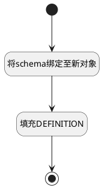

## full <!-- {docsify-ignore-all} -->

   

### 处理过程

### 处理步骤说明

#### 开始 :id=Begin [开始]

*- N/A*
#### 将schema绑定至新对象 :id=BINDPARAM_01 [绑定参数]

绑定参数`Default(传入变量)` 到 `schema`
#### 填充DEFINITION :id=PREPAREPARAM_01 [准备参数]

1. 将`schema.DEFINITION` 设置给  `Default(传入变量).DEFINITION(definition)`

#### 结束 :id=END_01 [结束]

返回 `Default(传入变量)`

### 实体逻辑参数

|    中文名   |    代码名    |  数据类型    |  实体   |备注 |
| --------| --------| -------- | -------- | --------   |
|传入变量(<i class="fa fa-check"/></i>)|Default|数据对象|[数据资源(DATA_RESOURCE)](module/meta/data_resource.md)||
|schema|schema|数据对象|||
